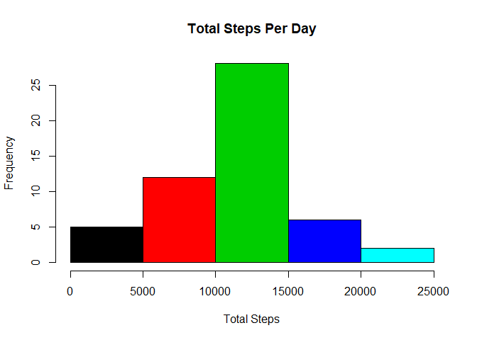
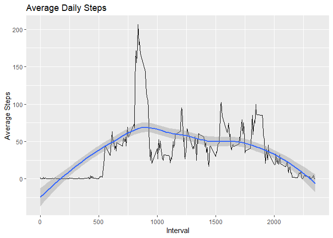
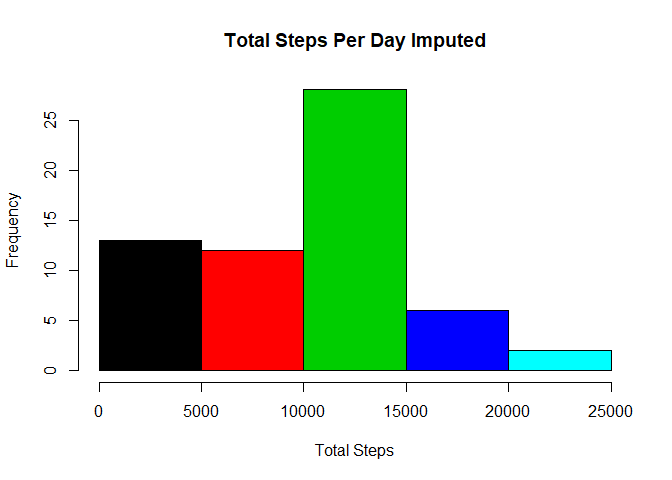
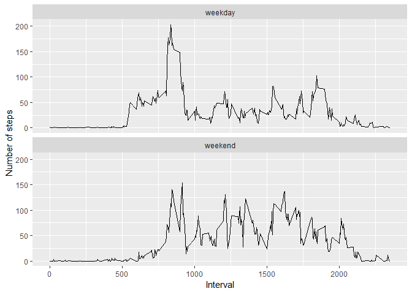

## Loading and preprocessing the data

```r
## Download File
zipurl <- "https://d396qusza40orc.cloudfront.net/repdata%2Fdata%2Factivity.zip"
if(!file.exists("./project")){
  dir.create("./project")
}
destFile <- "./project/factivity.zip"

download.file(zipurl,destFile)
unzip(zipfile=destFile,exdir="./project")

## Load Data
sourceFile = file.path("./project", "activity.csv")
list.files("./project")
```

```
## [1] "activity.csv"  "factivity.zip"
```

```r
activity <- read.csv(sourceFile)
summary(activity)
```

```
##      steps                date          interval     
##  Min.   :  0.00   2012-10-01:  288   Min.   :   0.0  
##  1st Qu.:  0.00   2012-10-02:  288   1st Qu.: 588.8  
##  Median :  0.00   2012-10-03:  288   Median :1177.5  
##  Mean   : 37.38   2012-10-04:  288   Mean   :1177.5  
##  3rd Qu.: 12.00   2012-10-05:  288   3rd Qu.:1766.2  
##  Max.   :806.00   2012-10-06:  288   Max.   :2355.0  
##  NA's   :2304     (Other)   :15840
```

```r
head(activity)
```

```
##   steps       date interval
## 1    NA 2012-10-01        0
## 2    NA 2012-10-01        5
## 3    NA 2012-10-01       10
## 4    NA 2012-10-01       15
## 5    NA 2012-10-01       20
## 6    NA 2012-10-01       25
```

## What is mean total number of steps taken per day?
For this part of the assignment, you can ignore the missing values in the dataset.

1: Make a histogram of the total number of steps taken each day

2: Calculate and report the mean and median total number of steps taken per day


```r
library(dplyr)
```

```
## 
## Attaching package: 'dplyr'
```

```
## The following objects are masked from 'package:stats':
## 
##     filter, lag
```

```
## The following objects are masked from 'package:base':
## 
##     intersect, setdiff, setequal, union
```

```r
steps_day<-
  activity%>%
  group_by(date) %>%
  summarize(total_steps = sum(steps)
  ) 
head(steps_day)
```

```
## # A tibble: 6 x 2
##   date       total_steps
##   <fct>            <int>
## 1 2012-10-01          NA
## 2 2012-10-02         126
## 3 2012-10-03       11352
## 4 2012-10-04       12116
## 5 2012-10-05       13294
## 6 2012-10-06       15420
```

### Histogram [Total Steps Par Day]


```r
library(ggplot2)
hist(steps_day$total_steps, col = steps_day$date,main="Total Steps Per Day", xlab="Total Steps")
```

<!-- -->
  


## What is the average daily activity pattern?

1: Make a time series plot (i.e. type = "l") of the 5-minute interval (x-axis) and the average number of steps taken, averaged across all days (y-axis)


```r
# aggrgate average data over interval
avg_steps_interval <- aggregate(steps ~ interval, activity, mean)
qplot(interval, steps, data = avg_steps_interval,geom=c("line")) + geom_smooth() + labs(title = "Average Daily Steps") + labs(x="Interval",y="Average Steps")
```

```
## `geom_smooth()` using method = 'loess' and formula 'y ~ x'
```

<!-- -->


2: Which 5-minute interval, on average across all the days in the dataset, contains the maximum number of steps?


```r
avg_steps_interval[which.max(avg_steps_interval$steps), ]
```

```
##     interval    steps
## 104      835 206.1698
```


## Imputing missing values
Note that there are a number of days/intervals where there are missing values (coded as NA). The presence of missing days may introduce bias into some calculations or summaries of the data.


1: Calculate and report the total number of missing values in the dataset (i.e. the total number of rows with NAs)


```r
# Total NA
sum(is.na(activity))
```

```
## [1] 2304
```

2: Devise a strategy for filling in all of the missing values in the dataset. The strategy does not need to be sophisticated. For example, you could use the mean/median for that day, or the mean for that 5-minute interval, etc.

```r
# average steps per day
avg_steps_day<-
  activity%>%
  group_by(date) %>%
  summarize(average_steps = mean(steps)
  ) 
avg_steps_day[is.na(avg_steps_day)]=0

act_i <- merge(activity,avg_steps_day)
```

3: Create a new dataset that is equal to the original dataset but with the missing data filled in.


```r
# NA’s are replaced with average steps for that day
activity_imputed <- act_i %>%
 mutate(steps = ifelse(is.na(steps),average_steps , steps))

summary(activity_imputed)
```

```
##          date           steps           interval      average_steps  
##  2012-10-01:  288   Min.   :  0.00   Min.   :   0.0   Min.   : 0.00  
##  2012-10-02:  288   1st Qu.:  0.00   1st Qu.: 588.8   1st Qu.:23.53  
##  2012-10-03:  288   Median :  0.00   Median :1177.5   Median :36.09  
##  2012-10-04:  288   Mean   : 32.48   Mean   :1177.5   Mean   :32.48  
##  2012-10-05:  288   3rd Qu.:  0.00   3rd Qu.:1766.2   3rd Qu.:44.48  
##  2012-10-06:  288   Max.   :806.00   Max.   :2355.0   Max.   :73.59  
##  (Other)   :15840
```

4: Make a histogram of the total number of steps taken each day and Calculate and report the mean and median total number of steps taken per day. Do these values differ from the estimates from the first part of the assignment? What is the impact of imputing missing data on the estimates of the total daily number of steps?


```r
steps_day_1<-
  activity_imputed%>%
  group_by(date) %>%
  summarize(total_steps = sum(steps)
  ) 
head(steps_day_1)
```

```
## # A tibble: 6 x 2
##   date       total_steps
##   <fct>            <dbl>
## 1 2012-10-01           0
## 2 2012-10-02         126
## 3 2012-10-03       11352
## 4 2012-10-04       12116
## 5 2012-10-05       13294
## 6 2012-10-06       15420
```

```r
hist(steps_day_1$total_steps, col = steps_day_1$date,main="Total Steps Per Day Imputed", xlab="Total Steps")
```

<!-- -->

## Are there differences in activity patterns between weekdays and weekends?


```r
# adding weekday and weekend type
activity_imputed$daytype[weekdays(as.Date(activity_imputed$date))  %in% c('Saturday','Sunday') ] <- "weekend"
activity_imputed$daytype[!weekdays(as.Date(activity_imputed$date))  %in% c('Saturday','Sunday')] <- "weekday"

activity_imputed$daytype <- as.factor(activity_imputed$daytype)

avg_imputed_steps_interval <- aggregate(steps ~ interval + daytype, activity_imputed, mean)
qplot(interval, steps, data = avg_imputed_steps_interval, 
      geom=c("line")) + 
      facet_wrap(.~daytype,ncol=1) +      
      labs(x="Interval",y="Number of steps")
```

<!-- -->
© 2019 GitHub, Inc.
